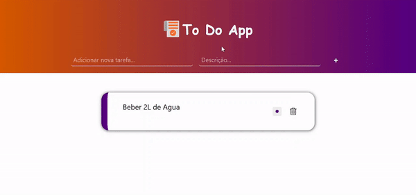

# To Do App

## Introduction

            

 

## Technologys

### Backend

- Python >= 3.10
- Flask

### Frontend

- JavaScript
- HTML
- CSS

## Run Local

### With Python

1. Install Python >= 3.10
2. Install (Poetry)[https://python-poetry.org/]
3. Install dependencies:
> `poetry install`
4. Start your application running:
> `poetry run flask run --debug`

### With Docker

1. Build the repository image:
> `docker build . -t <image-name>`
2. Run the container:
> `docker run -p 5000:5000 --name <container-name> -d <image-name>:<tag>`

Finish! Now the application are running in your machine!
