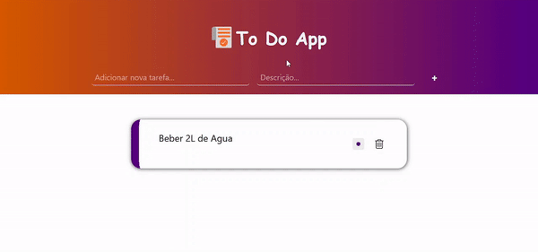

# To Do App

## Introdução

Aplicação feita em live para demostrar como ocorre a comunicação entre o frontend e o backend 

    

## Tecnologias Utilizadas

### Backend

- Python >= 3.11.0
- FastApi (e seu ecossistema)

### Frontend

- JavaScript
- HTML
- CSS

## Rodando Localmente

1. Crie e ative seu ambiente virtual do python atraves dos comandos:
    
    1.1 Criar  >> `python -m venv {nome do seu ambiente virtual}`

    1.2 Ativar:

    1.2.1 >> windows -> `{nome do seu ambiente virtual}\Scripts\activate`
    
    1.2.1 >> linux -> `source {nome do seu ambiente virtual}/bin/activate`

2. Instale as depêndencias atraves do comando: `pip install -r requirements.txt`

3. Inicie sua api rodando com o python o arquivo `./backend/main.py`
 
4. Baixe a extensão `Live Server` do vscode

5. Inicie sua aplicação frontend clicando com o botão direito no arquivo `./frontend/index.html` e depois clique na opção `Open with Live Server` ou `Abrir com o Live Server`

Pronto! Agora a aplicação está rodando localmente na sua maquina!
